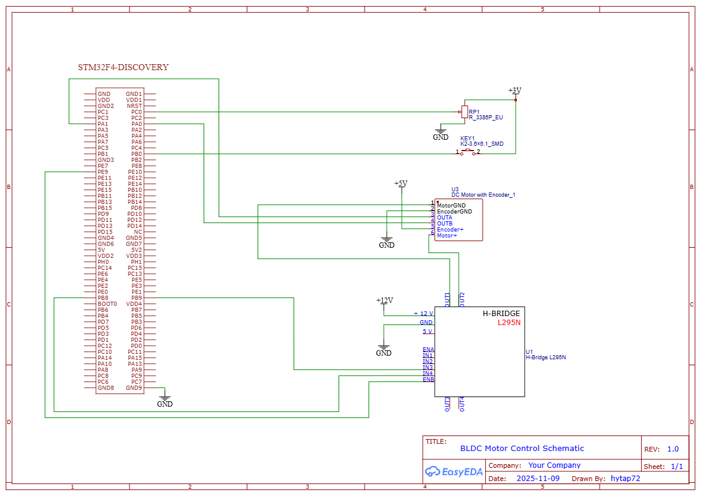

# STM32 Motor Control Bare-Mental Programming Project

## MCU
- STM32F411

## Features
- BLDC motor speed control using PID algorithm
- Bare-metal (register-level) programming

## Method
- PWM generation using timer

## Tools
- STM32CubeIDE

**Figure 1. Motor Control Schematic Using the STM32F411 Microcontroller**
